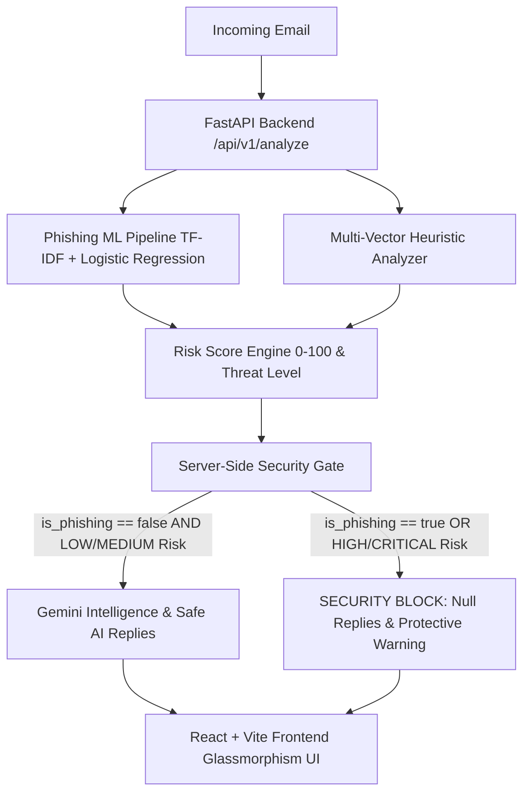

# AI Email Copilot

An enterprise-grade, AI-powered email intelligence and cybersecurity copilot that protects users against modern phishing attacks, extracts actionable intelligence using Google Gemini, and generates safe contextual reply drafts with server-enforced security gates.

---

## 1. Problem Statement

Email remains the #1 initial access vector for cybersecurity attacks. Modern cyber threats have evolved beyond crude spam:
- **Social Engineering & Brand Spoofing**: Attackers impersonate trusted enterprise tools (PayPal, Microsoft, internal HR/Finance).
- **Urgency & Psychological Coercion**: Fake deadlines and account suspension threats induce panic.
- **Header & Link Deception**: Spoofed Reply-To headers, URL shorteners, and raw IP addresses bypass standard filters.
- **LLM Safety Hazards**: Generative AI tools blindly replying to or interacting with malicious emails can compromise accounts and confirm active mailboxes.

---

## 2. Solution & Key Capabilities

**AI Email Copilot** combines a high-precision ML detection pipeline, multi-vector heuristic analysis, zero-trust server security gates, and Gemini-powered generative AI:
1. **Live Email Threat Scanner**: Real-time evaluation of sender headers, URL structure, and psychological urgency signals.
2. **Validated Phishing ML Pipeline**: TF-IDF + Regularized Logistic Regression trained on genuine cybersecurity threat benchmarks.
3. **Normalized Risk Scoring (0–100)**: Transparent risk categorization (`LOW`, `MEDIUM`, `HIGH`, `CRITICAL`).
4. **Explainable Threat Indicators**: Plain-English breakdowns of specific security risks detected in every message.
5. **Gemini Email Intelligence**: Executive summaries, prioritized action items, key takeaways, and safety guidance.
6. **AI Reply Suggestions**: Contextual drafts (`Professional`, `Friendly`, `Concise`) with full human-in-the-loop control.
7. **Zero-Trust Security Gate**: Authoritative server-side policy strictly blocks LLM reply generation on phishing or high-risk emails.

---

## 3. Architecture Overview



---

## 4. Validated Machine Learning Model

* **Architecture**: Scikit-Learn Pipeline combining `TfidfVectorizer` (sublinear TF, n-gram range `(1, 2)`, max 15,000 features) and `LogisticRegression` (balanced class weighting, L2 regularization, `liblinear` solver).
* **Saved Artifact**: `phishing-engine/saved_models/phishing_email_pipeline.pkl` (exact size: 703,623 bytes).
* **Zero Data Leakage**: TF-IDF vectorizer fitted exclusively on 1,600 training samples with zero overlap on the 400 held-out test samples.

### Validated Model Performance Metrics

Evaluated on 400 held-out test emails (200 Legitimate, 200 Phishing):

| Metric | Validated Score |
|---|---|
| **Accuracy** | **99.50%** |
| **Precision** | **99.50%** |
| **Recall** | **99.50%** |
| **F1 Score** | **99.50%** |
| **ROC-AUC** | **99.99%** |
| **True Positives (TP)** | 199 |
| **True Negatives (TN)** | 199 |
| **False Positives (FP)** | 1 |
| **False Negatives (FN)** | 1 |

---

## 5. Dataset Composition

* **Total Dataset**: 2,000 genuine email samples
* **Phishing Attacks (Label 1, 1,000 emails)**: Jose Nazario Phishing Corpus (`Nazario.csv`) — real-world credential harvesting, brand impersonation, and banking scams.
* **Legitimate Ham (Label 0, 1,000 emails)**: Enron Ham Corpus — authentic business correspondence, meeting notes, project updates, and memos.

---

## 6. Zero-Trust Security Architecture

1. **Authoritative Server Enforcement**: The server independently runs ML inference and heuristic feature extraction. Client-submitted `is_phishing` or `risk_score` values are never trusted.
2. **Gemini Invocations Suppressed**: For any email flagged as phishing, HIGH risk, or CRITICAL risk, Gemini is **never called**.
3. **Fail-Closed Design**: If internal security analysis fails or times out, reply generation fails closed (`reply_allowed: false`) to prevent accidental disclosure.
4. **Human in the Loop**: The system **never sends emails automatically** and does not connect to email write APIs. All AI drafts require manual review and copying.
5. **Prompt-Injection Defense**: Email content is isolated as untrusted data in system prompts to neutralize embedded LLM override attempts.

---

## 7. API Endpoints Reference

| Method | Endpoint | Description |
|---|---|---|
| `GET` | `/health` | Service health, model readiness status, and Gemini availability |
| `POST` | `/api/v1/analyze` | ML inference, heuristic indicator extraction, and risk scoring (0–100) |
| `POST` | `/api/v1/intelligence` | Gemini-powered executive summary, action items, and risk guidance |
| `POST` | `/api/v1/reply-suggestions` | AI reply drafts with server-enforced security gate |

Interactive OpenAPI documentation is available at `http://localhost:8000/docs`.

---

## 8. Quick Start Guide

### Prerequisites
- Python 3.10+
- Node.js 18+ and npm

### 8.1 Backend Setup (`phishing-engine/`)
```bash
# 1. Navigate to backend directory
cd phishing-engine

# 2. Create virtual environment and install dependencies
python -m venv .venv
# On Windows:
.venv\Scripts\activate
# On Linux/macOS:
source .venv/bin/activate

pip install -r requirements.txt

# 3. Configure environment variables (optional for live Gemini)
cp .env.example .env
# Edit .env and set GEMINI_API_KEY if desired

# 4. Start FastAPI server
uvicorn app.main:app --host 0.0.0.0 --port 8000 --reload
```

### 8.2 Frontend Setup (`frontend/`)
```bash
# 1. Navigate to frontend directory
cd frontend

# 2. Install dependencies
npm install

# 3. Start Vite dev server
npm run dev
# App will open on http://localhost:5173
```

---

## 9. Running Automated Tests

```bash
# Run backend test suite (122 tests)
python -m pytest phishing-engine/tests/ -v

# Run ML pipeline verification tests (13 tests)
python -m pytest ml/test_pipeline.py -v

# Build frontend production bundle
cd frontend && npm run build
```

---

## 10. End-to-End Demo Workflow

1. **Open Frontend**: Launch `http://localhost:5173`.
2. **Inspect Safe Email (`Sprint Retrospective`)**:
   - Security Shield displays **LOW RISK (Score: 8/100, Clean)**.
   - Gemini Email Intelligence generates an executive summary and prioritized action items.
   - AI Reply Suggestions generates **Professional**, **Friendly**, and **Concise** reply options with 1-click clipboard copy.
3. **Inspect Phishing Attack (`Bank Account Suspended`)**:
   - Security Shield turns critical red with **CRITICAL RISK (Score: 94/100, Phishing Threat)**.
   - Threat details highlight raw IP links (`192.168.1.1`), URL shorteners, header spoofing, and credential harvesting.
   - AI Reply Suggestions displays a **Security Block**; reply generation is completely disabled.
4. **Toggle Live Scanner**: Paste any raw email payload to inspect threat scores and live security verdicts in real time.
